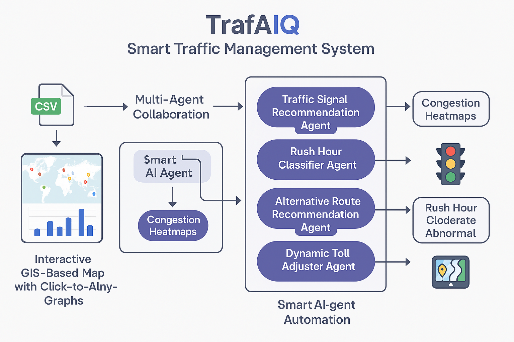
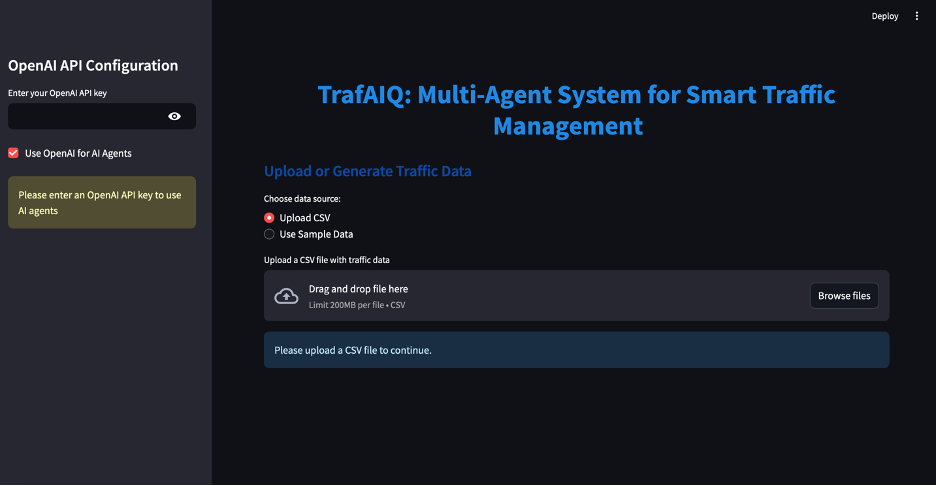
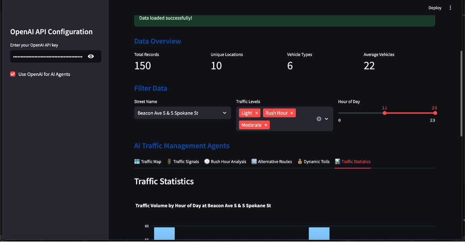
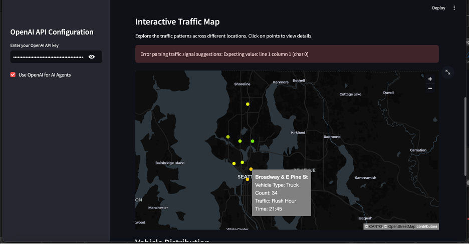

# 🚦 TrafAIQ: Multi-Agent AI-Powered Smart Traffic Management System

**TrafAIQ** is a multi-agent traffic optimization system that leverages AI-powered agents, live traffic data, and real-time analytics to reduce congestion, improve emergency response times, and enhance urban mobility. It uses **V2I (Vehicle-to-Infrastructure)** communication and **large language models (LLMs)** to dynamically manage traffic signals, reroute vehicles, and adjust toll pricing.

---



## 🧠 Features

- **Multi-Agent AI System** for traffic signals, routing, congestion detection, toll pricing, and drone monitoring
- **LLM-Powered Decision Making** to classify traffic levels, suggest optimal signals, and detect rush hours
- **Vehicle-to-Infrastructure (V2I) Communication** for smart, real-time traffic interactions
- **Dynamic Toll Adjustments** based on congestion severity and real-time conditions
- **Emergency Vehicle Prioritization** through adaptive signal control
- **Interactive Visualizations** with traffic maps, vehicle distribution charts, and congestion analysis
- **Modular Streamlit App UI** with plug-and-play capabilities for new agents

---

## 📊 Tech Stack

- **Frontend/UI**: Streamlit
- **Visualization**: PyDeck, Plotly
- **AI/ML**: OpenAI GPT (LLMs), Rule-Based Logic
- **Backend**: Python
- **Data**: Custom or real-time CSVs from traffic sensors, drones, or city datasets

---

## 🚀 Quick Start

### 1. Clone the Repository
```bash
git clone https://github.com/your-username/trafaiq.git
cd trafaiq
```

### 2. Install Dependencies
```bash
pip install -r requirements.txt
```

### 3. Add Your OpenAI API Key
Create a `.env` file and add:
```env
OPENAI_API_KEY=your-openai-key
```

Agents (implemented): 
1. Anlysise traffic congestion Agent
2. Suggest traffic lights Agent
3. Rush hour classification Agent (based on time and count) 
4. Rerouting Agent
5. Dynamic toll adjuster Agent 



### 4. Run the App
```bash
streamlit run smart_traffic_app.py
```

---


## 📂 Folder Structure
```text
trafaiq/
├── smart_traffic_app.py     # Main Streamlit App
├── requirements.txt         # Dependencies
├── traffic_data.csv         # Sample data file (optional)
├── .env                     # API key config
├── README.md                # This file
```

---

## 🌐 Use Cases

- Smart city traffic control systems
- Emergency route prioritization
- Adaptive tolling and congestion pricing
- Real-time urban mobility planning

---

## 📌 Future Improvements

- Integration with SUMO or CityFlow for real-time traffic simulation
- Edge deployment on Raspberry Pi and IoT cameras
- Autonomous drone support for visual input
- Real-time cloud sync and alerting system for emergencies

---

## ⚖️ Responsible AI Considerations

- Fairness in traffic signal decisions across locations
- Manual override for human-in-the-loop safety
- Explainable AI outputs for transparency

---

## 👨‍💻 Author

Made with ❤️ by ISAAC PREMKUMAR  
Let’s build smarter cities together.

---

## 📄 License

This project is licensed under the MIT License - see the [LICENSE](LICENSE) file for details.
